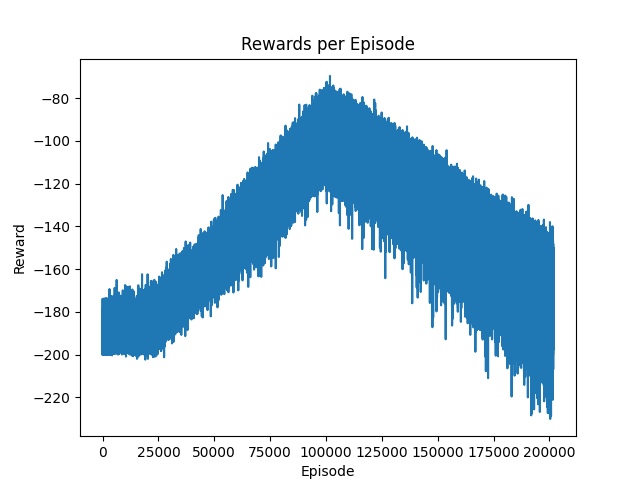

# Relatório

## Sumário

- [Relatório](#relatório)
  - [Sumário](#sumário)
  - [Contexto e objetivo do trabalho](#contexto-e-objetivo-do-trabalho)
    - [Dimensões do Problema:](#dimensões-do-problema)
    - [Modelagem e Estatísticas](#modelagem-e-estatísticas)
      - [Distancia:](#distancia)
      - [Volume de Combustivel de aviação por temporada:](#volume-de-combustivel-de-aviação-por-temporada)
      - [Preço gasto com combustivel de aviação por temporada:](#preço-gasto-com-combustivel-de-aviação-por-temporada)
      - [Pegada de carbono por temporada:](#pegada-de-carbono-por-temporada)
  - [Metodologia](#metodologia)
    - [Política de Rewards](#política-de-rewards)
  - [Resultados](#resultados)
    - [Validação:](#validação)
    - [Treinamento:](#treinamento)
  - [Considerações finais](#considerações-finais)
  - [Referencias](#referencias)

## Contexto e objetivo do trabalho

A Fórmula 1 é um dos esportes mais emocionantes e tecnicamente desafiadores do mundo, com equipes competindo em uma variedade de circuitos ao redor do mundo. No entanto, a logística do transporte de equipamentos entre esses locais é uma tarefa desafiadora e que consome muita energia. A ordem em que as corridas são realizadas muitas vezes resulta em rotas de viagem ineficientes, levando a um uso excessivo de combustível e uma maior pegada de carbono.

No ano de 2023 a formula 1 terá 23 corridas de acordo com este calendário oficial:
<p align="center">
  
</p>

A tarefa de encontrar o caminho com a menor distância passando por um dado número de pontos uma única vez e retornando ao ponto inicial é conhecida como Problema do Caxeiro Viajante ou TSP (Travelling Salesman Problem).

### Dimensões do Problema:
Para obter o número de possibilidades existentes de caminhos que passam uma unica vez em um numero n de pontos podemos utilizar uma permutação simples $n!$ dividido por $n$ pois estamos lidando com um ciclo fechado onde o último nó visitado é o nó inicial. E finalmente dividindo por $2$ pois temos um problema simétrico, de modo que a distancia percorrida é a mesma para um dado caminho independentemente do sentido. Portanto definimos que o espaço amostral do nosso problema como:

$$
S = \frac{(n-1)!}{2}
$$

Para 23 nodos temos:

$$
S = \frac{(23-1)!}{2} = \frac{22!}{2} = 5.62×10^{20}
$$

A nivel de compreensão do quão grande é este numero, se tivessemos um computador capaz de realizar 1 bilhão de checagens por segundo, demorariamos um total de 17808 anos para encontrar a solução ótima utilizando força bruta.

Assim, por simplificação do espaço amostral podemos facilmente concluir que se trata de um problema com complexidade $O(n!)$


### Modelagem e Estatísticas

Para modelar o problema vamos considerar o planeta terra como uma esfera perfeita de raio $R = 6371$, dessa forma, podemos utilizar a fórmula de Haversine para calcular a menor distancia entre dois pontos na superficie de uma esfera em função das cordenadas terrestres:

```python
def haversine(coord1, coord2):
    lat1, lon1 = coord1
    lat2, lon2 = coord2
    R = 6371.0  # radius of Earth in kilometers

    lat1_rad = math.radians(lat1)
    lon1_rad = math.radians(lon1)
    lat2_rad = math.radians(lat2)
    lon2_rad = math.radians(lon2)

    dlon = lon2_rad - lon1_rad
    dlat = lat2_rad - lat1_rad

    a = math.sin(dlat / 2)**2 + math.cos(lat1_rad) * math.cos(lat2_rad) * math.sin(dlon / 2)**2
    c = 2 * math.atan2(math.sqrt(a), math.sqrt(1 - a))

    distance = R * c
    return distance
```

Foi coletado a coordenada geográfica de todas as cidades em que ocorrerão os grandes premios da Formula 1 2023.

```python
cities = {
    0: "Sakhir, Bahrain",
    1: "Jeddah, Saudi Arabia",
    2: "Melbourne, Australia",
    3: "Baku, Azerbaijan",
    4: "Miami, USA",
    5: "Imola, Emilia Romagna",
    6: "Monaco, Monaco",
    7: "Barcelona, Spain",
    8: "Montreal, Canada",
    9: "Spielberg, Austria",
    10: "Silverstone, UK",
    11: "Budapest, Hungary",
    12: "Spa-Francorchamps, Belgium",
    13: "Zandvoort, Netherlands",
    14: "Monza, Italy",
    15: "Singapore, Singapore",
    16: "Suzuca, Japan",
    17: "Lusail, Qatar",
    18: "Austin, USA",
    19: "Mexico City, Mexico",
    20: "Sao Paulo, Brazil",
    21: "Las Vegas, USA",
    22: "Yas Marina, Abu Dhabi"
}

coordinates = {
    0: [26.0325, 50.5106],
    1: [21.5433, 39.1728],
    2: [-37.8497, 144.968],
    3: [40.3725, 49.8532],
    4: [25.7617, -80.1918],
    5: [44.3439, 11.7167],
    6: [43.7384, 7.4246],
    7: [41.57, 2.2611],
    8: [45.5017, -73.5673],
    9: [47.2197, 14.7647],
    10: [52.0786, -1.0169],
    11: [47.5839, 19.2486],
    12: [50.4372, 5.9714],
    13: [52.3886, 4.5446],
    14: [45.6156, 9.2811],
    15: [1.2914, 103.864],
    16: [34.8431, 136.541],
    17: [25.4207, 51.4700],
    18: [30.1328, -97.6411],
    19: [19.4326, -99.1332],
    20: [-23.5505, -46.6333],
    21: [36.1699, -115.1398],
    22: [24.4672, 54.6033]
}
```

Utilizando as coordenadas e medindo a distancia haversine de todo o percuros podemos obter as seguintes estatísticas:
|                                                                     | Valor       | Fonte                                                                                                                                                                                                                                  |
|---------------------------------------------------------------------|-------------|----------------------------------------------------------------------------------------------------------------------------------------------------------------------------------------------------------------------------------------|
| Consumo boeing 747                                                  | 12 L/km     | https://science.howstuffworks.com/transport/flight/modern/question192.htm#:~:text=A%20plane%20like%20a%20Boeing,liters%20of%20fuel%20per%20kilometer).                                                                                 |
| Preço combustivel de aviação                                        | 3.30 U$/galon   | https://www.bts.gov/newsroom/us-airlines-january-2023-fuel-cost-gallon-43-december-2022-aviation-fuel-consumption-down#:~:text=The%20cost%20per%20gallon%20of,from%20pre%2Dpandemic%20January%202019.                                  |
| Densidade do combustivel de aviação                                 | 0.8025 g/mL | https://www.lgcstandards.com/FR/en/Density-Jet-Aviation-Fuel-Nominal-0-8025-g-mL-15-C-/p/ALK-CRM-DEKR                                                                                                                                  |
| Massa de carbono por massa de combustivel de aviação queimado (Kg)  | 3.16        | https://www.iata.org/contentassets/922ebc4cbcd24c4d9fd55933e7070947/icop_faq_general-for-airline-participants.pdf                                                                                                                      |
| Número de aviões usados transporte estrutura Formula 1              | 6           | https://blog.gilbertintl.com/the-logistics-of-formula-1-transporting-1000-tonnes-around-the-globe#:~:text=As%20many%20as%20300%20trucks,they'd%20stretch%20over%205km.&text=6%20to%207%20Boeing%20747,km%20over%20the%20race%20period. |

#### Distancia:

$$
132179 [km]
$$

#### Volume de Combustivel de aviação por temporada:

$$
V = 132179 [km] * 12 [L/km] * 6 [aviões] = 9516288 [L]
$$

#### Preço gasto com combustivel de aviação por temporada:

$$
P =\frac{ 9516288 [L] * 3.30 [U\$/galon] } { 3,78541 [L/galon]} =  U\$ 8,295,997.10
$$

#### Pegada de carbono por temporada:

$$
C = 9516288 [L] * 0.8025 [g/mL] * 3.16 [Kg] = 24,133,876 Kg CO_2
$$


## Metodologia

Para resolver este problema, adotamos uma abordagem baseada em aprendizado por reforço, especificamente usando Pointer Networks e o algoritmo REINFORCE. Pointer Networks são uma variação dos modelos Sequence-to-Sequence com atenção, adaptados para produzir sequências de saída que são permutações de sequências de entrada, tornando-os adequados para problemas como o TSP. O algoritmo REINFORCE é usado para treinar a rede, ajustando os pesos do modelo com base na diferença entre a recompensa obtida e a recompensa esperada.

Vamos analisar a Pointer Network:
```python
class PointerNetwork(torch.nn.Module):
    def __init__(self, input_dim, embedding_dim, hidden_dim):
        super(PointerNetwork, self).__init__()
        self.embedding = torch.nn.Linear(input_dim, embedding_dim)
        self.encoder = torch.nn.LSTM(embedding_dim, hidden_dim, batch_first=True)
        self.decoder = torch.nn.LSTM(embedding_dim+1, hidden_dim, batch_first=True)
        self.pointer = torch.nn.Linear(hidden_dim, 1)

    def forward(self, x, last_idx, device: torch.device):
        batch_size, seq_len, _ = x.size()
        x = self.embedding(x)
        _, (hidden, cell) = self.encoder(x)
        last_idx_one_hot = torch.zeros(batch_size, seq_len).to(device)
        last_idx_one_hot.scatter_(1, last_idx, 1)
        decoder_input = torch.cat([x, last_idx_one_hot.unsqueeze(-1)], dim=-1)
        decoder_out, _ = self.decoder(decoder_input, (hidden, cell))
        scores = self.pointer(decoder_out)
        return scores.squeeze(-1)

```


A rede é inicializada com um vetor de entrada, uma camada de codificação (encoder) e decodificação (decoder), e uma camada de ponteiro (pointer).

O método forward define como a rede processa as entradas:
- Primeiro, a entrada é passada pela camada de incorporação (embedding) para transformá-la em representações de dimensões mais baixas.
- Essas representações incorporadas são então passadas pelo codificador LSTM.
- O índice do último passo de tempo é codificado como um vetor one-hot e concatenado à entrada incorporada.
- Isso é passado pelo decodificador LSTM, cuja saída é então passada pela camada do ponteiro para obter as pontuações. (precisamos informar a rede de qual a ultima ação escolhida para que ela leve isso em conta na hora de escolher a proxima ação, neste caso a proxima cidade a visitar)
- Essas pontuações indicam a probabilidade de cada item na sequência ser o próximo passo na sequência de saída.

Agora vamos analizar o agente:

```python
def __init__(self, input_dim, embedding_dim, hidden_dim, lr=1e-4):
    self.network = PointerNetwork(input_dim, embedding_dim, hidden_dim).to(device)
    self.network = torch.jit.script(self.network)  # JIT compilation
    self.optimizer = optim.Adam(self.network.parameters(), lr=lr)
```

Este método inicializa o agente com a rede de ponteiro e o otimizador Adam. A rede de ponteiro é compilada para um formato mais eficiente usando o Just-In-Time (JIT) Compiler do PyTorch.

```python
def select_action(self, state):
    batch_size, sequence_length, _ = state.size()
    start_idx = torch.zeros(batch_size, 1).long().to(device)
    log_probs = []
    actions = []
    mask = torch.zeros(batch_size, sequence_length).to(device)

    for _ in range(sequence_length):
        scores = self.network(state, start_idx, device)
        scores = scores.masked_fill(mask.bool(), float('-inf'))
        probs = F.softmax(scores, dim=-1)
        m = Categorical(probs)
        selected_action = m.sample()
        
        actions.append(selected_action)
        log_probs.append(m.log_prob(selected_action))
        mask = mask.scatter(1, selected_action.unsqueeze(1), 1.0)
        start_idx = selected_action.unsqueeze(1)

    actions = torch.stack(actions, dim=1)
    log_probs = torch.stack(log_probs, dim=1)

    return actions, log_probs

```
Este método define como o agente seleciona uma ação. Ele toma um estado de entrada e usa a rede para calcular pontuações para cada ação possível. As pontuações são transformadas em probabilidades usando softmax, que então são usadas para amostrar a ação selecionada de uma distribuição categórica. A máscara é usada para garantir que a mesma ação não seja selecionada duas vezes.

```python
def update(self, rewards, log_probs):
    loss = []
    for reward, log_prob in zip(rewards, log_probs):
        loss.append(-reward * log_prob)
    self.optimizer.zero_grad()
    
    loss = torch.cat(loss).sum()

    scaler.scale(loss).backward()
    scaler.step(self.optimizer)
    scaler.update()
```
Este método define como o agente é atualizado com base nas recompensas recebidas e nas probabilidades logarítmicas das ações selecionadas. O otimizador é usado para atualizar os parâmetros da rede com base na perda calculada. A perda é calculada como o produto negativo da recompensa e do log_prob. O "GradScaler" é usado para realizar uma otimização mista de precisão para aumentar a eficiência do treinamento.

Essencialmente, a classe `Agent` representa um agente de aprendizado por reforço que usa uma política de rede de ponteiro para selecionar ações e aprende a melhorar essa política com base nas recompensas recebidas.

Finalmente, usamos a heurística do vizinho mais próximo como uma forma de dar à rede um bom ponto de partida em termos de política inicial. A heurística do vizinho mais próximo é uma abordagem simples, mas eficaz, para o TSP que seleciona a cidade mais próxima ainda não visitada como a próxima cidade a visitar.

### Política de Rewards

```python
for epoch in range(n_epochs):
    with autocast():
        action, log_prob = agent.select_action(state)
        n_points = action.shape[1]
        distances = torch.empty(n_points - 1).to(device)
        reward_heuristic = 0
        if epoch < warm_up_episodes:
            score = 0
            for i in range(23):
                if action[0][i] == heuristic[0][i]:
                    score += 1
            score = score / 23
            reward_heuristic = ((score)*100)-200

        for i in range(n_points - 1):
            # Index into the distance matrix for the precomputed distance
            distances[i] = distance_matrix[action[0, i].item(), action[0, i+1].item()]

        # Fetch the distance from the last to the first point
        last_to_first = distance_matrix[action[0, -1].item(), action[0, 0].item()]

        reward_distance = -(torch.sum(distances) + last_to_first)

        # Combine the two rewards
        reward = (reward_distance*reward_scale)*distance_weight + (reward_heuristic)*heuristic_weight

    agent.update([reward], [log_prob])
```

O código apresentado implementa uma versão de um algoritmo de aprendizado por reforço chamado "Política de Gradiente de Atores" (PGAC, do inglês Policy Gradient Actor-Critic) para solucionar o problema do Caixeiro Viajante.

Em um algoritmo de aprendizado por reforço, a política de recompensas (ou "reward") é uma parte crucial. Ela determina o feedback que o agente (neste caso, o Caixeiro Viajante) recebe com base em suas ações. A ideia é que as recompensas incentivem o agente a tomar ações que levem a resultados melhores e desencorajem ações que levem a resultados piores.

No código apresentado, a política de recompensa é composta por duas partes:

- `reward_distance`: Esta recompensa é calculada com base na distância total que o Caixeiro Viajante teria que percorrer se seguisse a rota proposta. Esta parte da recompensa é negativa e escalada por reward_scale, de modo que rotas mais curtas resultem em recompensas maiores (ou menos negativas).

- `reward_heuristic`: Durante os primeiros warm_up_episodes, esta recompensa é calculada com base em quão semelhante é a ação proposta à solução heurística (neste caso, uma solução baseada no algoritmo do "vizinho mais próximo"). A semelhança é expressa como uma porcentagem da correspondência entre a ação proposta e a solução heurística, e depois subtraída de 200, resultando em uma recompensa que vai de -200 (para ações que não se parecem nada com a solução heurística) a 0 (para ações que são exatamente a solução heurística).

A recompensa total é uma combinação ponderada de `reward_distance` e `reward_heuristic`, com os pesos de cada componente sendo ajustados a cada época. Inicialmente, o `reward_heuristic` tem um peso maior, e o `reward_distance` tem um peso menor. À medida que a formação avança, o peso do `reward_heuristic` diminui lentamente e o peso do `reward_distance` aumenta lentamente. Isso permite que o agente comece aprendendo a imitar a solução heurística, e então gradualmente passe a focar mais na minimização da distância total.

Finalmente, o algoritmo implementa uma versão do critério de parada antecipada: se a recompensa não melhora por um número especificado de épocas (determinado pela variável early_stopping_patience), o treinamento é interrompido e o agente com a melhor recompensa até o momento é selecionado. Isso pode ajudar a prevenir o excesso de ajuste e economizar tempo de computação.

## Resultados

### Validação:
Para validar o nosso algorítimo vamos utilizar o método Held-Karp que garante a descoberta da política ótima em um tempo $O(2^nn^2)$ através de programação dinâmica;. Esta complexidade não é ideal para a solução do problema para um maior número de pontos, mas para 23 nodos ja torna o problema factivel quando comparado à $O(n!)$. O algorítimo held-karp encontra poíticas ótimas de subconjuntos de $n$ e vai escalonando para enfim convergir na poítica ótima. Hoje em dia ja existem algorítimos mais avançados que utilizam a técnica de `branch and bound` e consguem a poítica ótima em um tempo bem menor e possibilita a analise para um maior número de pontos.

Aqui está o código usado para no cálculo do problema utilizando o algorítimo Held-Karp:

```python
def held_karp(cities):
    n = len(cities)

    # Pre-compute distance matrix
    dist = [[distance(cities[i], cities[j]) for j in range(n)] for i in range(n)]

    C = {}
    for k in range(1, n):
        C[(1 << k, k)] = (dist[0][k], [0, k])

    for subset_size in range(2, n):
        print(f"Considering subsets of size {subset_size}")  # Print current subset size
        for subset in itertools.combinations(range(1, n), subset_size):
            bits = 0
            for bit in subset:
                bits |= 1 << bit

            

            for k in subset:
                prev = bits & ~(1 << k)

                res = []
                for m in subset:
                    if m == 0 or m == k:
                        continue
                    res.append((C[(prev, m)][0] + dist[m][k], C[(prev, m)][1] + [k]))
                C[(bits, k)] = min(res)
        print(f"Considering subset {subset}")  # Print current subset
        print(f"Minimum distance ending at city {k} is {C[(bits, k)][0]}")  # Print current city and minimum distance

    bits = (2**n - 1) - 1

    res = []
    for k in range(1, n):
        res.append((C[(bits, k)][0] + dist[k][0], C[(bits, k)][1] + [0]))
    opt, path = min(res)

    return opt, path
```

### Treinamento:
<p align="center">
  
</p>

Neste grafico podemos observar que por volta dos 100000 episodios onde o agente ja aprendeu a imitar a solução heurística, a recompensa começa a cair, ou seja o reward maximo do agente é ligeiramente melhor que a heuristica. Isso se deve ao fato de que a solução heurística não é a solução ótima, e o agente aprende a melhorar a solução heurística. Entretanto, devido a grandiosidade do espaço amostral, o agente diverge e não consegue encontrar a solução ótima. Entretanto, como desejamos treinar um agente que seja bom apenas para essa configuração especifica, o treinamento é interrompido e o agente com a melhor recompensa até o momento é selecionado.

A política ótima encontrada pelo algorítimo held-karp é a seguinte:

```python
list = ['Sakhir, Bahrain', 'Lusail, Qatar', 'Yas Marina, Abu Dhabi', 'Baku, Azerbaijan', 'Suzuca, Japan', 'Singapore, Singapore', 'Melbourne, Australia',
         'Sao Paulo, Brazil', 'Miami, USA', 'Mexico City, Mexico', 'Austin, USA', 'Las Vegas, USA', 'Montreal, Canada', 'Silverstone, UK', 'Zandvoort, Netherlands',
           'Spa-Francorchamps, Belgium', 'Barcelona, Spain', 'Monaco, Monaco', 'Monza, Italy', 'Imola, Emilia Romagna', 'Spielberg, Austria', 'Budapest, Hungary',
             'Jeddah, Saudi Arabia', 'Sakhir, Bahrain']
```
Ela pode ser melhor visualizada no mapa executando o arquivo `3d-map.py`

Ao considerarmos a política ótima podemos novamente calcular as estatísticas a título de comparação:
|        | Distancia [km] | Volume [L] | Preço [U$]   | Carbono [Kg] |                     |
|--------|----------------|------------|--------------|--------------|---------------------|
| Atual  | 132,179        | 9,516,288  | 8,295,997.10 | 24,295,997   | % da política atual |
| Agente | 69,726         | 5,043,632  | 4,396,878,41 | 12.876.878   | 53                  |
| Ótima  | 62,142         | 4,474,224  | 3,900,486    | 11,346,185   | 47                  |

## Considerações finais

Em conclusão, este trabalho apresenta um método promissor para otimizar a logística de corrida da Fórmula 1, contribuindo para os esforços contínuos da organização para reduzir sua pegada de carbono. Embora a mudança para motores V6 híbridos tenha tido um impacto significativo, este trabalho destaca a importância de também considerar outros aspectos da operação da F1.

Como um ponto adicional, e em um tom mais leve, muitos fãs da Fórmula 1 têm saudades do som dos motores V8. Ao reduzir ainda mais a pegada de carbono através da otimização logística, quem sabe não podemos abrir espaço para a volta dos motores V8 sem aumentar as emissões totais? Afinal, a Fórmula 1 é tanto sobre a emoção e a paixão dos fãs quanto sobre a tecnologia e a inovação.

Acreditamos que os métodos desenvolvidos neste trabalho têm o potencial de contribuir para um futuro mais sustentável para a Fórmula 1

## Referencias
Esta referencia é a base do trabalho, e foi utilizada para a definição da rede neural e do algorítimo de treinamento:
[Neural Combinatorial Optimization With Reinforcement Learning](https://arxiv.org/pdf/1611.09940.pdf)
